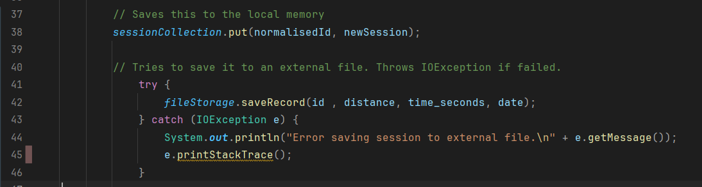

# TDD-Diary

## Table of Contents

<!-- TOC -->
* [TDD-Diary](#tdd-diary)
  * [Table of Contents](#table-of-contents)
  * [Summary](#summary)
  * [Introduction](#introduction)
    * [Few Important notes](#few-important-notes)
  * [Day 1 - 08/01-25](#day-1---0801-25)
    * [RecordTests](#recordtests)
    * [FileStorage](#filestorage)
    * [RecordHandler](#recordhandler)
  * [Day 2 - 'First Sign of Insanity' - 09/01-25 to 10/01-25](#day-2---first-sign-of-insanity---0901-25-to-1001-25)
    * [Calculator](#calculator)
    * [User](#user)
    * [Main](#main)
  * [Day 3 - 'Wave of Despair' - 11/01-25 - 12/01-25](#day-3---wave-of-despair---1101-25---1201-25)
    * [ScannerWrapper](#scannerwrapper)
  * ["Day 4" - 'A Mad Scientist and His Google' - 13/01-25](#day-4---a-mad-scientist-and-his-google---1301-25)
    * [Agenda](#agenda-3)
    * [MenuHandler](#menuhandler)
    * [Integration of classes](#integration-of-classes)
  * [Day "4" - 'Here Lies Madness' (In a Good Way!) - 13/01-25](#day-4---here-lies-madness-in-a-good-way---1301-25-)
    * [MenuHandler (again)](#menuhandler-again)
  * [Day 5 - 'The Productivity of a Night Owl' - 14/01-25](#day-5---the-productivity-of-a-night-owl---1401-25)
    * [Fleeting-Notes](#fleeting-notes-4)
    * [ScannerWrapper](#scannerwrapper-1)
    * [MenuHandler](#menuhandler-1)
    * [InputLimit](#inputlimit)
  * [Day "most likely 5.5" - 'Sanity Restored' - 17/01-25](#day-most-likely-55---sanity-restored---1701-25)
    * [FileStorage](#filestorage-1)
  * [Day "6" - 'The Light at the End of the Tunnel' - 19/01-25](#day-6---the-light-at-the-end-of-the-tunnel---1901-25)
    * [MenuHandler](#menuhandler-2)
<!-- TOC -->

## Summary
This is a TDD-Diary made for a project that lasted around 1.5 weeks for IT-Högskolan in Gothenburg, Sweden.
The diary itself is very informal and leans way more into the actual definition of a diary over documentation.
I have also taken the liberty of just having fun with this diary over being overtly formal/static! So for those that do
decide to read through this, take everything with a grain of salt and just enjoy the rolle-coaster I had during the
projects' lifespan!

---
## Introduction
The general structure of the diary will follow a daily chapter including the goals and solutions to said goals.
Reflections and comments will be added as deemed necessary for clarity. Each day will in most cases start with a checklist
to *attempt* to avoid side-quests. The diary itself will be written directly with very little filter, so there will be 
times when the text devolves into ramblings and bouncing thoughts. I thought it would be for the best to give a better
insight over what is going on in my head. My main reason is due to my very unstructured way of working and tendency
to fall into big coding sprees without realising it.

With that said, feel free to jump to certain sections from the ToC or skim. Most of the details over what I'm currently
working with lies within the titles. With `Fleeting-Notes` being my place for random notes that isn't related to anything
specific.

The entire project is set up as a repository on GitHub for version control and ease of access.
Maven and Jacoco is used within the project as of writing. If VG assignments are made then Mockito was used as well.

Preface: I did work with **FileStorage** right away and then reformated it to suit my needs. I'll add it again
if I do work on the VG part of the assignment.

### Few Important notes
Automatic date will be set if it finds an empty whitespace, if *nothing* is entered then you will
hit the error handler for string-input. This is the case for most of the "empty" inputs.
The reason is due to my scanner not allowing a fully empty input and will **force** the user to re-enter a new input.

Needed "functions" have marked TODO comments above them to help the teacher find the exact tests easier!

Program can be run from main and will create a temporary user to simulate it being read from the external file. This
is mostly for demo purposes and imitating a user opening upp their app again after a couple of sessions.
---

---
## Day 1 - 08/01-25

- [x] Set up repository and skeleton to start project.
- [x] Write up initial mockup of diary.
- [x] Start feature-branch.
- [x] Create **Record** class and it's tests.
- [x] Implement tests for **FileStorage**. (now named **RecordHandler**)
- [x] Adjust **FileStorage** until functional according to tests. (now named **RecordHandler**)
- [x] Create a **RecordHandler** that contains a Map to use ID as keys to avoid duplications.
- [ ] Create a **Calculator** for all formulas and math needed for the project.
- [ ] Create a **Main** that will allow the user to input and use the program.

### Agenda
Create a **RecordTest** file to create tests which includes all variables included in Records (variables based on
parameters from **FileStorage**).

After baseline tests are made, create **Record** class and shape it to fit tests.

---
### Fleeting Notes
Record might not be the best word for the files, not sure what to call a "saved trip/run/walk". As much as I want to
name it "session", it might does not sound entirely correct either.

### RecordTests
Noticed that I did write a few scuffed initial drafts for the tests due to not having coded for about 2 weeks.
Note to self to make sure to stay on top of coding whenever on break, even if it's just a little bit of code.

Example of issues were:
- The initial structure.
- Asserts having the expected/actual in swapped positions.
- Somehow forgetting the () when calling to methods. (I'm honestly baffled that it just slipped my mind)
- I missed that id was a string initially. (I blame it on new year)

</img>
### FileStorage
Will rename this file to **RecordHandler** to simplify the naming-scheme. Also, easier to identify what it's connected to
in my opinion.

### RecordHandler

Might be overdoing it with throws and checks during the test, but I'm giving it a go to do a thorough test-setup
to see how far I can push my own knowledge of working TDD. (which I'm not used to)

Lots of new things came up such as writing tests for exception-handling and throws. Stumbled upon a few issues that I
had to resort to Stack Overflow. Based on the projects tests now, it seems to be fully functional and work as intended.
I'm still not feeling 100% confident regarding this so it will have to be something I work with more down the line.

---

---
## Day 2 - 'First Sign of Insanity' - 09/01-25 to 10/01-25

- [x] Rename **Record** to something more relatable and self-explanatory. (Now **Session**) 
- [x] Create a **CalculatorTest** for all formulas and math needed for the project.
- [x] Create a **Calculator** to code in said formulas.
- [ ] Create a **Main** that will allow the user to input and use the program.
- [x] Create a **User** that will handle user data.
- [ ] Advanced G assignments. (Kept as a single point for now)
- [ ] Start on VG assignments.
- [x] Create tests for a singleton **Scanner**. Accidentally made prior to tests.

### Agenda
Continue from previous days leftovers and work from there. Goal is to ideally get the G assignments done by end of day.
If possible also add the advanced features into it before working on VG assignments.

Combined 2 dates into "day 2" because of my narcolepsy hindering me from working on the project for the majority
of 09/01.

---
### Fleeting Notes
As discussed with Max during yesterday's lesson, **Record** was not a fitting name for what we are trying
to save. Two potential names were "**Session**" and "**Activity**". Noted within agenda to keep track as of why
the change was made.

Debating if "TotalFitnessScore" should be a value stored with SessionHandler or User. If kept with the handler then it's
stored with all the sessions it has within the collection, logical. But since it's a fitness app and revolves around
the user, then storing the score with the user also works. Especially if we want to enable user to "remove" sessions but
keep their score (or if they re-install the app from a new phone for example).

### Calculator
(✅)TODO: Set up all calculations needed for a session.

Calc consists of:
- Average speed
- Kilometres per hour/min
- "FitnessScore" (score based on session) \
  FitnessScore **needs** to show a positive integer and only whole numbers. Score starts at 0 if it's the **first**
  session.
- Total distance traveled across all sessions.
- Average distance traveled across all sessions.

#### Reflections
Creating tests for these as opposed to coding them up first is way trickier due to the need of "foresight"
for how the formulas will be used. All without coding it up. I'm fully aware that we only care about the output to assert,
but I'm the type that wants to understand how the process goes before making a tests. It helps me visualise it better.

The first few tests worked fine but FitnessScore was a bit more troublesome to make up. Both due to it
having 2 conditions over it being the first ever session or not, and the fact that it needs to make use of
"days since the previous session" for the formula. This means that you can't just send in a single session but now needs
either 2 latest sessions to calculate the days between, or send in the whole handler and extract the 2 latest sessions.

*Extended break between previous text and following (about 18h)*

The calculation between the "days since previous session" was the most troublesome to write tests for and code up.
The rest were on an acceptable level and got sorted quite fast. I do think I need more practice to *not* think about each
individual code and just work with the logic of input/output. I consider calculator to be complete for now though, there
are places I can improve or make better. But I would like to get a proper MVP before refactoring something that already 
works.

### User

User will be kept barebones for now and only contain whatever the assignment asks for + name.
Test are there to just ensure that setting and getting the names works as intended.

### Main

I've had somewhat of a hard time with creating tests for main. One reason being that I'm not sure if I should create
a second file called **MenuHandler** to essentially create/handle all types of menu system that will be needed for the 
different actions the user shall be able to make. The second reason is that it requires a lot of "human" input through
scanner. My initial thought would be to use "System.setIn", similar to ScannerSingletonTest, but I've been contemplating
**Mockito**. The idea is to essentially "mock" the inputs and test from there. If it does turn out working well then I'll 
most likely proceed to adjust the old tests to fit it. Will probably do a refactoring pass for all code eventually.

I'm proceeding with creating a **MenuHandler** file. It feels logical to push menu systems and switch cases to a separate file.
I'll also try to add **Mockito**. Mockup of Mockito tests are done, I'm afraid to say that I think a Singleton has come
to bite my ass once again. I need to figure out how to replace the singleton with my mock without causing issues.
I'll most likely find some solutions from StackOverflow and patchwork it somehow.

</img>
_rant_: I **hate** singletons, christ. ok I'm taking a break from the entire project due to frustrations.

#### Reflection
After a longer than expected nap, I've decided to redo the entire scanner and all it's tests. I'll try to make as many
commits as possibles to show the changes, but I'm fully expecting myself to just forget to do it in the midsts of refactoring.

This and all leftover code/plans will be pushed to day 3.

---

---

## Day 3 - 'Wave of Despair' - 11/01-25 - 12/01-25

- [ ] Advanced G assignments. (Kept as a single point for now)
- [ ] Start on VG assignments.
- [x] Create a **Main** that will allow the user to input and use the program.
- [x] Reformat/Re-do **Scanner** in its entirety. (Removing Singleton)
- [ ] Complete the writing of tests for **MenuHandler**.
- [x] Develop **MenuHandler** based on tests.

### Agenda
Today's biggest goal is to get **MenuHandlerTest** fully functional with tests based on **Mockito**. To do that
I need to refactor **ScannerSingleton** and its tests since I believe that it's the biggest cause based on the error
messages. 

Snippet: "Mockito is currently self-attaching to enable the inline-mock-maker.
This will no longer work in future releases of the JDK..."

I've tried to solve it, but it turned out to be quite convoluted and required a JVM argument and IDE specific settings.
For me that's a no-go because of the sole principle that it would require setup from new users/workstations. My ideal
solution is that it should be self-sufficient and portable, able to be tested right away on download from GitHub.

A commit will be made before the large scale changes to create a backup in case I totally break it, or I find a solution
to the singleton issue down the line. Whichever comes first to be honest. (I'm quite frustrated with this to be honest)

---
###  Fleeting Notes
The amount of extra research and frustration I get with scanner is baffling. I get why it is the way it is but my god
does it feel _extra_ to handle. Both in how sensitive it is and how different the tests are made for it.

### ScannerWrapper
I'll be renaming **ScannerSingleton** to **ScannerWrapper** due to the removal of singleton, but also clarity. Since 
this class will encompass all the scanner related functions. This is a bit of an odd situation since I do work with
the mental image of how I've created the previous Scanner files in past projects. So the test might now be totally free
of "bias" as they normally would. 

I'll be splitting tests into invalid/valid or yes/no to create a more clear labeling of what it tests.

Methods will be similar to my previous projects, setup with validations and forced loops to ensure correct returns.

#### Reflections
the fact that I had to capture a whole string and convert it because it contained a single "\n" is crazy. I sat and tried
to find the issue for so long and the issue was that ".contains" method couldn't differentiate and read a \n the same way.
The entire process was quite a trial and error on top of searching for answers.

I did forget to commit between creating code and writing tests. It is mostly due to me jumping back and forth developing
1 singular method after each test. Especially due to how finicky scanners are.
</img>

I did solve the issue with the assertTrue to a printing of an error message not passing. It had to do with me not creating
a stream for **err** prints specifically. Which I did not expect to be 2 whole separate channels/streams. It has now 
been fixed by also generating a stream for it specifically. I have an ish understanding but not 100%. Will have to play
around with this further to grasp it completely.

Tried being somewhat smart with being DRY, only to have that backfire. Had to add `scannerWrapper = new ScannerWrapper();`
in each method instead of once in `@BeforeEach`. Not totally sure why that is but will experiment with it.

Adding messages after each test, or at least trying to since it helps to see where the tests fail and the cause.

It also just hit me that I totally forgot the reason why I even wanted to do Mocks out of these.
This might be the 1 bad reason to goblin code at night. I also noticed that Jacoco is not picking up my tests done
for `ScannerWrapper`

Final words regarding scanner; it's not fully covered yet but the important tools for inputs are sorted. I once again
want to say that I **do not** like scanner now after this roller-coaster. 

---
***
## "Day 4" - 'A Mad Scientist and His Google' - 13/01-25

- [ ] Advanced G assignments. (Kept as a single point for now)
- [ ] Start on VG assignments.
- [ ] Complete `MenuHandler`'s functions (few adjustments left)
- [ ] Code cleanup, remove old redundant code or non-used code.
- [ ] Create new function in `ScannerWrapper` for `MenuHandler` methods. (tests too)

### Agenda

Ideally get done with all the G related assignments today if I have missed any. 

---
### MenuHandler
I'll be looking into mocking up the other classes to make the tests independent from `Session` and `SessionHandler`.
Though I will _start_ with writing test in a way I know works to get the project to move forward.

The idea is that the menu handler will be printing instructions and menus, and ask for the input.
One example being `searchSessionById`, this method should be called when the user selects "search for session" within
a menu and then be prompted to input text to search for. From here it will branch into 2 cases. Either a list of matching
sessions are printed and the user can then proceed to pick one to show details of, or no matches are found, and you will be notified
regarding it.

#### Reflection
I ended up essentially making identical tests and methods as `sessionHandler`. Creating a new commit to start from a clean
slate with empty tests.

Trying to break down the tests into smaller bits, in this case _only_ checking for whatever prints are happening.
Reasoning behind that is due to us already having tests for the manipulation of sessions within `SessionHandlerTest`.
I'll add more tests/code to `SessionHandlerTest` now when I have more functions I want to implement.

### Misc - Ramble Text
</img>
Sorting sessions method done, `getSortedSessions`. I stumbled upon a few good explanations across google and will do a 
quick deep dive to *attempt* at making this sorting flexible based on what the user picked. Not going to implement it
fully to the actual project, but I want to see if it's possible with `.sorted()` call. Initial idea is to make an
Enum class that contains all types of comparators like comparing `(s1, s2) -> Double.compare(s1.getDistance(), s2.getDistance());`
for example. The general structure is the same, but you are just comparing different values!

**LETS GOOO, IT WORKED!**
I was not too sure if it would work, but it seems to work suuuper smoothly. This means that I could in theory let the 
user choose a sorting method with a switch-case and then pass it on to `getSortedSessions`. I won't focus on it now
though due to it not being relevant to the project. Tests to assure it works are there as well just as a FYI.

I'm diving back into singletons, I can't believe that I'm doing that... 
Update: jokes on me, it's still horrid.🙃 I'll temporarily pass the scanner for now, refactoring it later should not
be too difficult this time around due to the smaller project scale.

### Integration of classes
Whilst testing for singletons and scanner shenanigans I also started refactoring `User`. The user now includes a collection
of sessions (`SessionHandler`). This is both because of simplicity of parameters, and it being quite logical to have
the collection tied to a user. I've now started working on `MenuHandler` again for the 10000th time. I'll be honest and say
that I'm somewhat lost over how to write the tests. 

#### Reflection
I do think my excessive googling has backfired due to the sheer amount
of different opinions, styles, versions both testing and mockito have. I went through so many versions of mockito to try
figure out the issue to no avail. I'm not getting any compilation errors anymore which I'm glad for, but at the cost of
a super messy project. This can be seen by my mixture of variable naming, code structure. 

---

---
## Day "4" - 'Here Lies Madness' (In a Good Way!) - 13/01-25 

- [ ] Advanced G assignments. (Kept as a single point for now)
- [ ] Start on VG assignments.
- [x] Refactor `MenuHandlerTest`, and add more tests
- [ ] Complete `MenuHandler`'s functions
- [x] Hate on Scanner a bit more
- [x] Look into mocking further and refactor accordingly.

### Agenda
Goal for this part would be to finish up the `menuHanlder` so that the project will be an actually functional program.
The methods in question will be mostly menu systems to redirect to appropriate method calling, such as add session, that
will have its own followup of prompted inputs to fill in the details of a session.

### Fleeting-Notes
I feel like I've worked somewhat backwards with this, or at least I should've looked more into mockito properly since 
I had some gigantic troubles with **Scanner** and mocking. Which caused me to go down a rabbit hole of cursed stuff.
The idea of mocking for `menuHandlerTest` is to avoid essentially testing whatever scanner already have. We should not
care about the logic and if the return is correct, but rather the outcome of the entire method.

Totally forgot to check off the lil checklist. Most of the documentation are within the text and my rants!

---
### MenuHandler (again)
Refactored the entire `MenuHandlerTest` and it now incorporates mocking, specifically scannerWrapper. Tests works properly
now and I can proceed to make more tests for the branching menu. I won't cover all the branching paths if they call for a similar
method/ same method with another argument. 

Deep diving into the furthest branch to develop first due to me technically branch testing all the way
to reach that endpoint. So I will test "some" branches more due to me passing through menus. In this case deleting
a session whilst viewing the details

</img>
**Order of menus:**
Main Menu > session menu > view all sessions > detailed session view > delete method. 

By going this way I won't need to create tests for the menus themselves, but more if they accomplish the goal of 
passing me through to the right methods. If I went the other way around, then some of these tests would become redundant.
**TDLR**: Menus are a means to an end.

Test created and fully functional. Started with working on the method itself as a public call. Then worked my way
outwards towards `runMainMenu()`. That way the preceding menus will be created and tested along the path but not fully
developed due to missing method calls within the other cases.

With the deletion sorted, I'm now more confident in writing tests for this type of code. Going over to creation and 
searching for sessions tests. Ideally I would like to assert that the `sessionHandler` properly executed the task
and assert that the output was correct.

Currently hitting a bit of a snag, I want to create more `scannerWrapper` methods to fulfill unique needs
such as `dateInput()` or `minutesInput()` that would parse input and return proper data to create
a session. Will try to make a functioning base for now and then write tests for these methods and then develop them
 ✨(ITS SOON REFACTORING TIME)✨  

Baseline developed code are functioning, ironing out kinks I found and in the process of removing some redundant methods
such as `printAllSessions` and `printQueryResults`. Both essentially do the same thing, and I can refactor 
`resolveSessionView` to take in an argument of `List<String>` so it would work with both the search logic and standard
view.

### Reflection
**MEGA PRODUCTIVE DAY** I might've still hated on scanner *but*, it turned out to work quite smoothly when you don't
try to solve both `byteArrayInput` and `Mockito` whilst trying to further progress your tests/code. Especially if
2 of the issues turned out to be standard warnings that are quuuuite *recent*...

I might work more today, but odds are not. Got an early hospital visit the next day (14/01), so I'll not push myself to
work anymore unless a 💡 hits.

---
***

## Day 5 - 'The Productivity of a Night Owl' - 14/01-25

- [x] Advanced G assignments. (Kept as a single point for now)
- [ ] Start on VG assignments.
- [x] Complete `MenuHandler`'s functions (few adjustments left)
- [ ] Code cleanup, remove old redundant code or non-used code. (Partial)
- [x] Create new function in `ScannerWrapper` for `MenuHandler` methods. (tests too)

### Agenda
Ideally get done with all the G related assignments today if I have missed any. Most of the heavy work is sorted
and passed their respective tests. When G is done, look into VG assignments and determine if it's easier to implement
*before* or *after* code clean-up. Before that is definitely adding tests and code for `ScannerWrapper` to preserve
the class logic of single responsibility.

### Fleeting-Notes
Once again, I'm struck with narcolepsy and now started working at 23:27 on the 14th... I feel like the "Day x" for me does not 
work at all due to this.🙃
---
</img>
Added a few `minutes > seconds` methods and the inverse to avoid faffing with writing 10023 seconds. It feels more
normal to input how many minutes you have been exercising.

Missed to write a try/catch block in `MenuHandler > resolveSessionCreation()`, also added `id.tolower()` for the hashmap
to ensure that the key's stay the same.

Not going to lie, `menuHandler` is handling **A LOT**. It should have been split into multiple classes. But it was 
created with *hate* and *despair*... I'll ~~maybe~~ fix it if I find the time. But it's a cursed child of mine that was 
made during the projects darkest times and shall forever be stained as such.👀 I'll at least sort it somewhat with regions.

Noticed some small spots I've missed due to only seeing green tests. It was more UX/UI related or logic that the tests
*shouldn't* cover. I would say the reason for that is because so much is tied to the menu logic that is not related
to the assignment.

### ScannerWrapper
Added tests for valid date input `checkIfValidDate`. Might change the rest of input validations to reflect a specific
assignment if the need is specific it enough, such as date, double/int instead of casting (int) etc.

All of that is lower prio due to not being related to assignment as a whole, back to `MenuHandler`!

I've made use of `scannerWrapper` to ensure that a date always is returned, even if someone enters a **blank**
space. `dateInput` will automatically return the current time if no other *proper* date is given.
**if** they somehow manage to enter nothing for date, then I created a constructor for session that does not
take in a `LocalDate` which sends `LocalDate.now()` to the date. Tests was also made ahead of time. 

Another test added is `dateInputTest_BlankInput()` in `ScannerWrapper`.

### MenuHandler
I'll have to restructure the menu slightly to accommodate `showUserInfo()` within the main menu. Multiple tests
will most likely fail due to mocking of menu choices changing.

Tried to create an adaptable mock that counted switch-cases(choices) and sent in an `int` to `numberInput` to add that
as a max limit. The issue is that I then would have to remake the entire structure of Mock/when inputs for each
singular menu (since they are all different in amounts). For the sake of the assignment, I'll not work on this function
despite knowing that people can enter a number that would result it in being out of bounds.

I can do a `while(true)` forced loop during wrong input. But that would also lead to multitudes of
mocked `0`inputs to step out one menu after the other.

Need to add an option pre search or post search to sort list based on time/distance.  
I decided to change the logic instead, sending in restructured session based on search into `viewSessionList()`.
From there on out it loops within itself and re-arranges the list as needed depending on the choices of the user.
The one drawback would be that you have to exit manually instead of getting lobbed to the out-most menu. 
`changeSortMethod_SessionPrintTest()` tests this functionality and by proxy, ensuring that one of the 6 sort
methods are functional.

### InputLimit
Added a quick enum for the character limit for certain inputs. Only name and session are implemented due to ease of change.
Int would most likely rely on me changing a few things with how int works, and that would in turn cause quite an effect
on the whole system. Ofc tests help minimise the time spent, but we also have to consider the fact that it's out of 
scope of our assignment.

## Day "most likely 5.5" - 'Sanity Restored' - 17/01-25

- [ ] G/VG - Create test to *filter* based on time/distance/date (Dunno what's expected here, like before or after x?)
- [ ] ~~Refactor `MenuHandler` *again*, it's way too fat and the method names is set up in such a way that I most likely can 
break out methods without much issue.~~
- [x] Look into code clean up, adding comments to clarify methods.
- [x] Start VG assignments (did this before I made the checklist.) 

### Agenda
Finish off everything I might have missed and sort `FileStorage`. My current idea is to just move over the collection to
`fileStorage` to mimic our data storage. This means that I have to move over the collection from `sessionhandler` which 
hopefully won´t cause any issues, especially now when all tests are green and fully functional. Some adjustments might be
needed.

---

### FileStorage

Added a few tests that the rest will follow in terms of structure, the way I'm implementing the external `FileStorage`
mock is by calling for it with no actual return. These calls will be put into methods that performs the exact same functions,
but towards the local memory instead of external. Example in the image where I create a session to both the local and
external "memory".

Creating a commit here to give a view of the start of RED. Next commit will be greens + refactors most likely since these
methods only need to be called.

I've now created tests and added a simple call to each method responsible for the same function within my actual project
to mock our `FileStorage`'s function. I also just discovered and made use of `anyString()`. That and the related
methods like int and more are amazing!!
---

---
## Day "6" - 'The Light at the End of the Tunnel' - 19/01-25

- [x] Add some structure and clarity to the diary for ease of navigation.
- [x] Add comments to point out what test covers what part of assignment.
- [x] G/VG - Create test to *filter* based on time/distance/date (Dunno what's expected here, like before or after x?)
- [x] *Actually* take a break for once.
 
### Agenda
Sort out the *filter* to make sure I'm covering the expected type of filter the assignment wants. Most likely skipping
the larger refactor of `MenuHandler` due to the fact that it's technically out of scope and would clutter more.
It would also cause more of a hassle to read through the methods due to the constant jumping back and forth with `prints`.

### Fleeting-Notes
I'm intentionally omitting some tests due to an overlap of tests. I'm **fully** aware that it goes against the principle
of singular task tests, but testing a menu will inherently test the function it calls upon as well.

---
### MenuHandler
</img>
Added yet another branch to enable the user to search for specific values such as time and distance. Date will be
added towards next commit since the test is yet to be made. They should all follow the same structure with the 
difference being `LocalDate`. The method for distance and time use the same method and makes use of a `Function` parameter. 
This is the first time I'm using it here, and it's surprisingly nice to just send a set property method to call.
For now that's also the only place I'm using the enum for limit of these 2 values. (I'm very much out of scoping and
no longer have the energy to scope creep all my methods across the entire file (~~especially scanner~~)).

After I'm done with creating the search function for date then I'll consider myself entirely done with implementing code.
There might be some extra tests to be made for extra coverage of branches/use-cases. Except that then it's only refactoring
and code-clean up!

